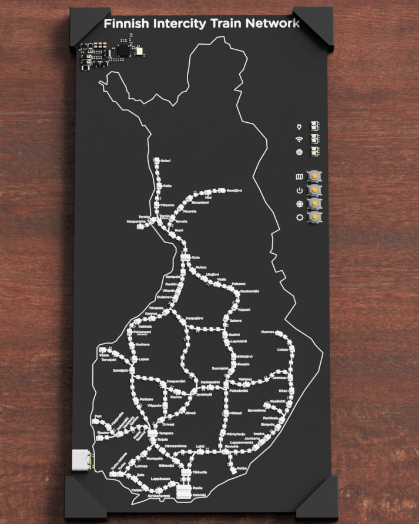

# Finland live train map

The project consist of the physical pcb and case as well as the server that processes the information from the api and serves it to the ESP-32 to process. The physical project is a pcb with LEDs marking the route for intercity trains across Finland. There are two versions of the map. A more simplified version with just the routes visible. Then there is the more geografically correct version with the borders of Finland printed on the silkscreen. The LEDs mark the position of trains in real time so you can see at a glance where the trains are. The case makes it possible to wall mount the pcb or have it on your desk.

This project was made for Hack Club [Fallout](https://fallout.hackclub.com) by [NoseFa](https://github.com/NoseFa) and [Hekinav](https://github.com/HekiNav).

## Repository structure / table of contents

**Each directory contains its own README file with more detailed information on the specific section. Basic information is provided here.**

### [`/pcb`](./pcb/README.md)
Contains KiCad design files
View interactive PCB design in [KiCanvas](https://kicanvas.org/?github=https%3A%2F%2Fgithub.com%2FHekinav%2FFinland-Live-Train-Map%2Ftree%2Fmain%2Fpcb)

**NOTICE**: KiCanvas does not properly render everything, please hide layers User.1-User.5 to view power circuitry. These layers mark the different power circuits

### [`/design`](./design/README.md)
Contains Map Design ideas and plans as Inkscape SVGs

NOTE! All software has been moved to [another repo (HekiNav/ltm-firmware)](https://github.com/HekiNav/ltm-firmware)

### [`/server`](https://github.com/HekiNav/ltm-firmware/tree/main/server/README.md)
Contains the NodeJS server that processes data from Fintraffic to amore usable format

### [`/firmware`](https://github.com/HekiNav/ltm-firmware/tree/main/firmware/README.md)
Contains the Platformio firmware for the ESP32C3

### [BuildGuide.md](BuildGuide.md)
Contains instructions for building the project.

## Why this exists

This project was made because we wanted to work on something together and Hack Club was running the Fallout event. Hekinav has built a similar type of project before for Helsinki. [The Helsinki Live Train map](https://github.com/HekiNav/helsinki-live-train-map) and we decided that making one of all the Trains in Finland would be cool. This project is meant to be something to look at and something cool to have in your space. Thats why we put so much effort in the silkscreen of the pcb and the placement of the LED's. We wanted it to be good to look at.

## Zine page

Soon...

We were required to make a zine page for Fallout.
