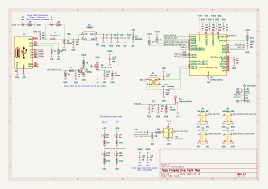

# PCB Design
- Made in KiCad with [CDFER's JLCPCB KiCad library](https://github.com/CDFER/JLCPCB-Kicad-Library). 
- Inspiration for antenna and power system taken from [CDFER's live train maps](https://keastudios.co.nz). They are very cool!
- Designed to be fabricated and assembled by JLCPCB
    - PCBA by JLC because tiny components and hundreds of leds are hard to assemble manually. Also, LCSC components are very cheap with JLC.
    - 

## Main components
- ESP32-C3FH4 (chip or module)
    - 4MiB built-in flash
    - Chip/module pros and cons (currently chip)
        - Chip is more aesthetical
        - Module has a built-in antenna
- Level Shifter (3V3 data from esp to 5V led data)
    - [TI SN74LV1T34DBVR](https://www.lcsc.com/product-detail/C100024.html)
- Power management
    - USB VBUS to 5V and 3V3 rails
    - Mosfet to shut down 5V rail
- 239 ARGB LEDs: [Xinglight XL-1615RGBC-2812B-S](https://www.lcsc.com/product-detail/C41413180.html)
    - The -S version is less bright and cheaper than the non -S version. 
    - These LEDs are a cheaper alternative to WorldSemi WS2812Bs

### KiCanvas viewer
View interactive PCB design in [KiCanvas](https://kicanvas.org/?github=https%3A%2F%2Fgithub.com%2FHekinav%2FFinland-Live-Train-Map%2Ftree%2Fmain%2Fpcb)

**NOTICE**: KiCanvas does not properly render everything, plase hide layers User.1-User.5 to view power circuitry

## Schematic

